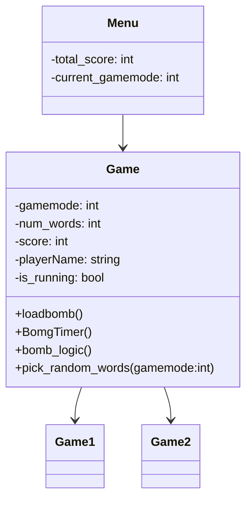
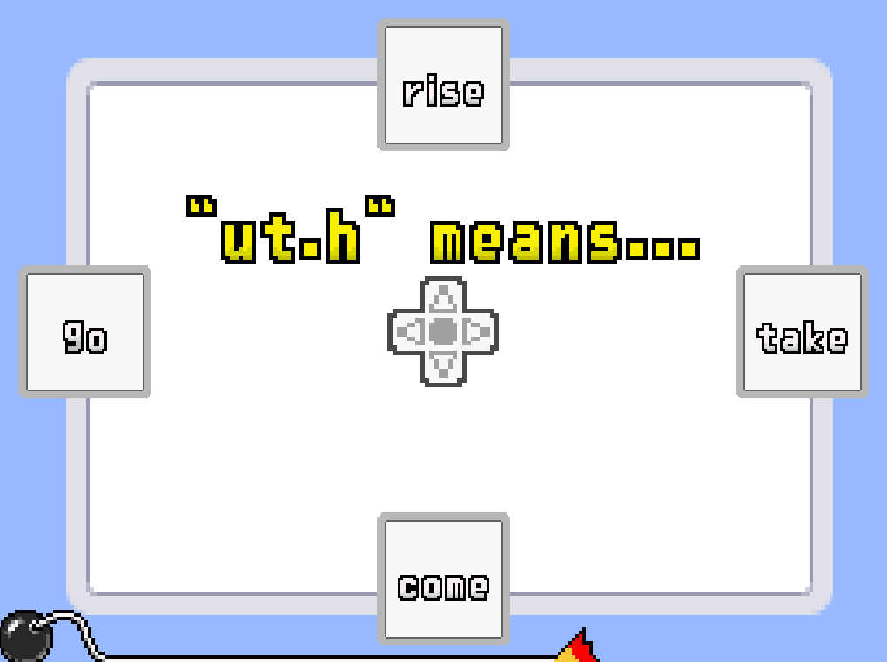
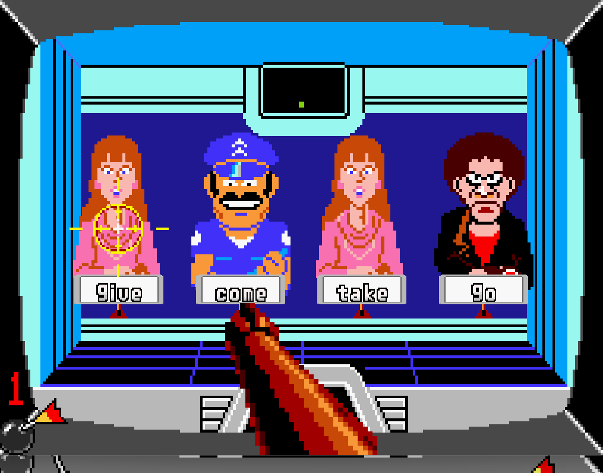
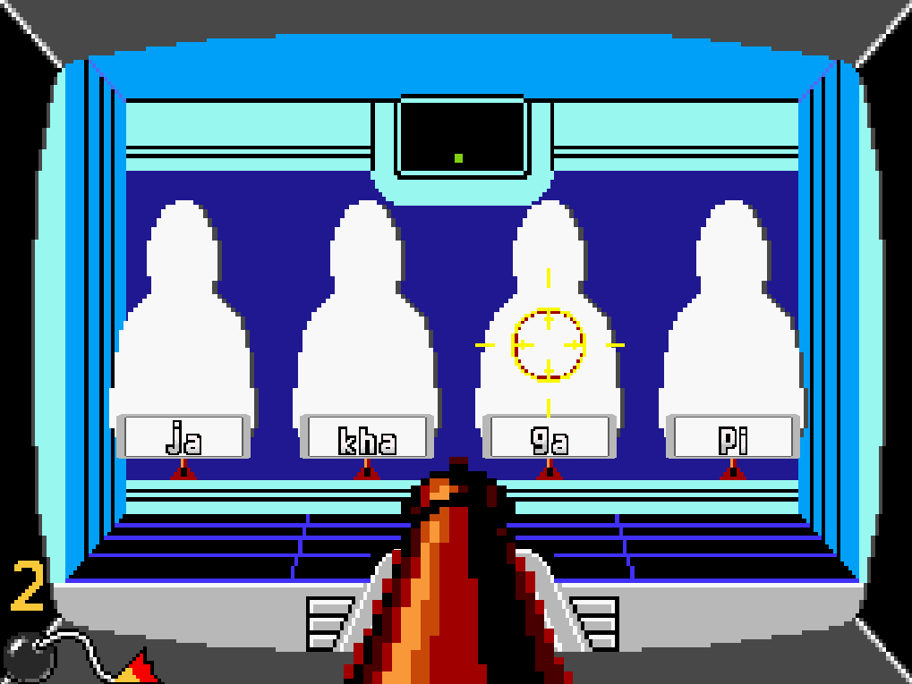
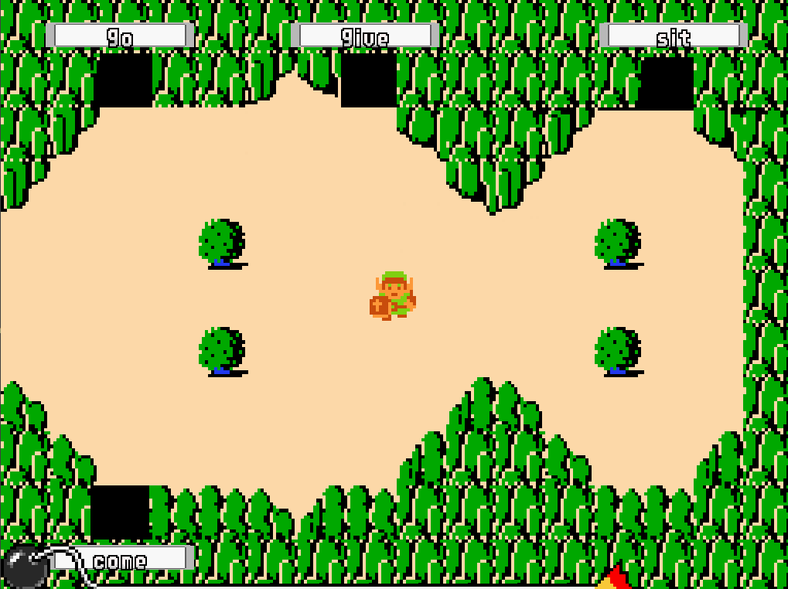
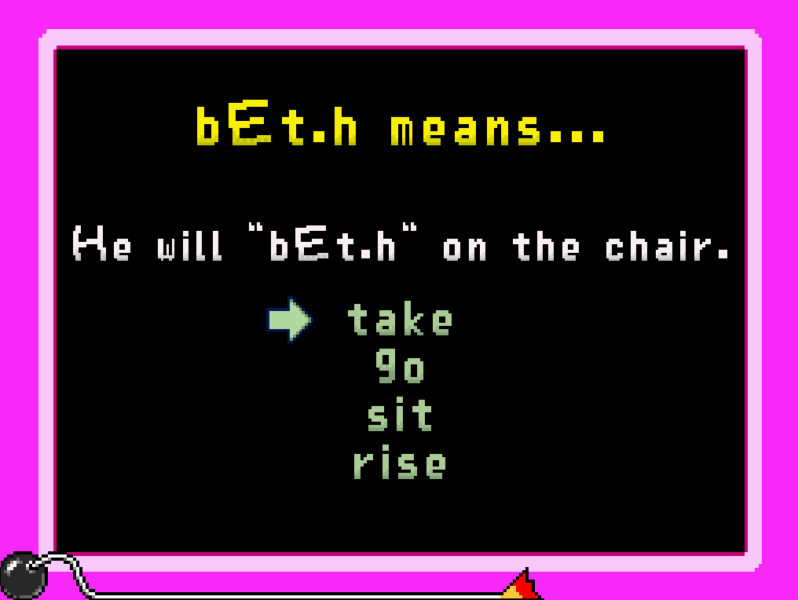
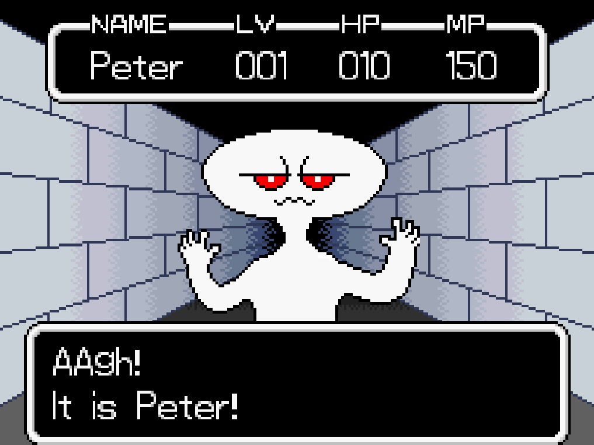

# Python-Linguistic-Vocabulary-Game
A python game for learning vocabularies for a linguistic course

## Used Libraries:
- Pygame
- Pygame_menu

## Structure of our Game
Menu: The main menu of our game is a slightly edited version of the default pygame_menu menu.
Game: This class keeps track of the score and starts each game.
- HogansAlley
- QuickieQuiz
- PraiseOrHaze
- Zelda
- Boss

## Inspiration and Concept
The inspiration to our game comes mostly from a Microgame collection from the game "Wario Ware", where players must react quickly to very short and simple tasks ranging from 2 to 5 seconds. We choose this idea because short games it makes it easy to replay the tasks for memorizing vocabulary and small scope grammar. This keeps users motivated to keep on learning by playing the games. The microgames made the work distripution a lot easier for us, too

In our game the player can choose between 3 different gamemodes, which resemble the 3 tasks given from the course.
Each gamemode lets the player play various tiny games, that are played around 5 second each. The player needs to solve questions and earn points in gamemode 1 to unlock gamemode 2. The same condition applies for gamemode 3.

### Gamemode 1: Vocabulary
This gamemode's aim was to teach the player a small vocabulary of 7 urdu words and their category as an agentive/non-agentive word. For these two goals we have separate prompts for the games, which switchs up randomly.

#### Task 1
The first task of the vocabulary gamemode was to teach the player 7 urdu vocabularies. For that we ask the player a word and the player has to choose the correct translation out of 4 displayed options. The games give hints at what the correct option is, so that players who don't know the answer are able to learn so.

#### Task 2
The second task of of the vocabulary gamemode prompts the player to choose between "Yes" and "No" to decide whether a verb is agentive or non-agentive.

### Gamemode 2: Grammar
In the grammar gamemode the player is asked to pick a word out of 4 options, that fits with the displayed word in order to make sense.

### Gamemode 3: Trial
The last gamemode is a test, consisting of a round based game where the player has to defeat an enemy. This includes some of the other microgames. The player has to choose right options from the questions in gamemode 1 and 2 but without their tips, in order to progress in this mode and beat the enemy. Each won round lowers the enemies HP while losing just one round makes the player loose the entire game. If the player manages to defeat the enemy, they progress to level 2, which increases the enemies HP.

## All the Scenes:
All games ask the player with a prompted question to choose between 2-4 options.

### Quickie Quiz
This game shows the player 2-4 directions (up, down, left, right) as a choice to choose an option from. This can be done by simply pressing one of the keybuttons \(\leftarrow \), \(\uparrow \), \(\downarrow \) or \(\rightarrow \) corresponding to the options. When the players choses the right option, it will be marked as correct and the next round begins. If the player chose the wrong option, all the wrong options are shown as incorrect and the next round begins. 

### Hogans Alley
This game gives the player options chosen from left to right and can have as many or less options are possible because it's scalable over the screenwidth. Each option is displayed as a person, whereas the correct option is a thug, while all wrong options are women or police officers. The goal is to select the thug by pressing the keybuttons \(\leftarrow \) or \(\rightarrow \) to select a person. Pressing the keybutton Enter shoots the thug, representing the correct answer to the question. For the Trial gamemode this game hides the characters before the selection was made to prevent hints for the player.
 

### Zelda
In this game the player is able to walk around with the keybuttons \(\leftarrow \) or \(\rightarrow \). For each possible answer, one cave will appear. If the players walks into a cave, the corresponding word will be selected as answer.

### Praize or Haze
This game shows the player a question together with a hint to the corect answer. Below that are the options to chose from with the keybuttons \(\uparrow \) and \(\downarrow \). The selection has to be verified by pressin Enter. The hints for the correct answer are individually created for each single answer possibility.

### Boss
This game is only playable by getting a score of 2000 and starting the "Trial" gamemode. The player encounters different enemies. Each enemy has a certain amount of HP. The goal is to reduce the enemy's HP to 0. This can be done by answering the prompted questions in the chat correctly. The answers can be picked by pressing the keybuttons \(\leftarrow \), \(\uparrow \), \(\downarrow \) or \(\rightarrow \) and pressing the Enter button.

### Menu
In the meanu a custom font is used by importing a TrueType Font (.ttf) file and a custom "designed" logo inspirated by the original WarioWare Logo. Here you can always go back to from the pause menu by clicking "ESC" to change teh gamemode after you earned enough points.

## What did each of us do?

### David
David implemented the games:
- PraiseOrHaze
- Boss

Additionally he implemented:
- Game Fonts
- Transitions between games
- Menu design

In the beginning i had mny problems with the right scaling of the sprites and getting the, which got much more easily with time and a sort of feeling for the number to use to move sprites around. Thats why later in the Boss Game I used hardcoded sizes for positioning of sprites while I used screen-sized dependet values for PraiseOrHaze. The main issues was the Main Game logic, escpecially what part of the minigames we could put in the Game class to re-use in the otehr minigames. My biggest encounter was the creating of the Font. I researched and tried quite a while until i got it to work. It scann though the font sprite line for line with the first pixel in the left upper corner as "Background" and ends a symbol once it detect a Background pixel after detecting a not Background pixel. I alligned all symbols to the bottom line, why letters like "g" and "y", which should be below the bottom textline are kind of "levitating" and look a bit weird. Later while working on the Menu design I found out that I could have just downloaded or create a .ttf file for everything, because the pygame_menu can only use these and not my Spritefont created Fonts. Another big problem I run into was crashing during animation, if clicked anything. Escpecially in the Boss game i had many issues with animation crashes or overlaping. But most of these Problems were later solved by putting boolean states during animation, during which the player input was completly blocked. But some errors remained if the PLayer clicks something during a specific moment like in the Boss game during The Boss spwn it resets the game.

### Pascal
Pascal implemented the games:
- Quickie Quiz
- Hogans Alley
- Zelda

Additionally he implemented:
- Word selection for all games (GameLogic)

### Together
- The Main logic in Game
- The Menu
- very much troubleshooting

## Interesting Codesnippets
### Combining dicts

    options = dict(zip(positions, options_list))

With the "zip" function we were able to combine lists into a dictionary. This helped us a lot because our fundamental data structure used for the answers and options are dictionaries. Dictionaries have a value and key. Therefore we can always find the key or the value if we only have on od those. This matches perfect for a "question-answer" structure like vocabularies in our case.

This is our Vocabulary file where we defined the possible classes and translations for the verbs as dictionaries:

    lightVerbs = {
        "le": "take",
        "de": "give",
        "a": "come",
        "ja": "go",
        "bEt.h": "sit",
        "ut.h": "rise"
    }

    lightVerbsAgentive = {
        "le": "agentive",
        "de": "agentive",
        "a": "non-agentive",
        "ja": "non-agentive",
        "bEt.h": "non-agentive",
        "ut.h": "non-agentive"
    }

    agentive_verbs = {
        "le": "take",
        "de": "give",
        "mar": "hit",
        "duba": "dunk",
        "ga": "sing",
        "sikh": "learn",
        "kha": "eat",
        "pi": "drink",
        "d.al": "put"
    }

    non_agentive_verbs = {
        "a": "come",
        "ut.h": "rise",
        "par.": "fall",
        "bEt.h": "sit",
    }

    ambiguous_verbs = {
        "ja": "go"
    }

## Documentation